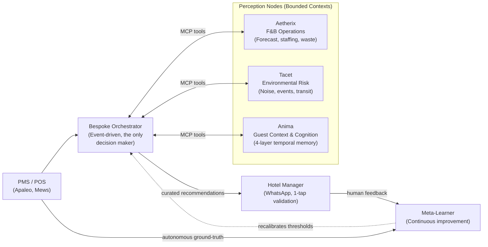

<h1 align="center">Hospitality Agentic Mesh</h1>

  <em>Operational memory for hotel operations: A network of specialized AI agents that anticipate guest needs, evaluate autonomously, and learn from every service to optimize operations and cut costs.</em>

  <a href="https://ivandemurard.com/aetherix">Case study</a> ·
  <a href="https://github.com/IvandeMurard/tacet-app">Tacet (public repo)</a> ·
  <a href="https://www.linkedin.com/in/ivandemurard/">Contact</a>

---

## The Vision: AI as a Living Operational Memory

This Hospitality Agentic Architecture turns AI into a **living operational memory**. Rather than just generating a static F&B forecast or a daily report, the Mesh acts as a living cognitive system for the property:
- **Understands, like a human:** Contextual reasoning grounded in each property's history, powered by a unified signal ontology that translates chaotic real-world events into structured, cross-domain context.
- **Measures, like a machine:** Every recommendation is stored next to its real outcome, so the system explicitly knows what it said versus what actually happened.
- **Learns, like a network:** Per-property memory today, federated priors next, leveraging shared intelligence to give independent hotels the power of a hive.

The individual forecasts and risk scores are just sensory organs. The true product and value lies in the **per-property memory** as it builds a compounding asset that continually optimizes operations, cuts waste, and elevates the guest experience.

## What this is

This is the public meta-repo of an multi-agent system I've been building solo since late 2025. It serves as the architectural blueprint for an event-driven network of AI agents designed for hotel operations.

At a glance:
- **A Multi-Agent System:** This repo documents the architecture and engineering practices, while the actual execution nodes (like Aetherix) live in separate repositories.
- **Perception Nodes:** Specialized agents that own strict bounded contexts. They expose their capabilities as [MCP](https://modelcontextprotocol.io) tools and focus purely on *understanding* data, never deciding.
- **Bespoke Orchestrator:** A central decision engine built entirely from scratch. It holds 100% of the reasoning loop to separate perception from action, ensuring a human manager is always the final authority.

## The Mesh Architecture

### Core Design Principles

1. **Execution nodes never orchestrate.** The perception nodes (Anima, Aetherix, Tacet) strictly *interpret* signals within their domain. They never decide when to run or what action to take. The bespoke Orchestrator holds 100% of the decision logic.
2. **Glue, not replacement Delivery.** The Mesh operates via a PMS-agnostic canonical schema behind adapters. Intelligence is delivered directly inside the tools managers already use (e.g., 1-tap WhatsApp "receipts" summarizing the reasoning), requiring zero new dashboards to monitor.
3. **Preventing HITL (Human-in-the-Loop) Fatigue.** Human-in-the-loop is structural, but a manager bombarded with alerts will ignore them. The Orchestrator uses calibrated thresholds to filter out the noise, sending only high-significance, composite recommendations.
4. **Continuous Improvement (The Meta-Learner).** The system employs a dual learning strategy to continually optimize the Orchestrator's decision thresholds:
    - *Human Feedback Loop:* Every manager's 1-tap response (accept/reject) trains the system.
    - *Autonomous Loop:* The system automatically compares its past predictions against the actual ground-truth data flowing from the PMS/POS, self-correcting without human intervention.
5. **Hive Memory (Federated Priors).** To solve the cold-start problem for new hotels, a federated "Hive" layer shares anonymized, learned priors across properties, ensuring day-1 effectiveness without leaking tenant data.

## The Nodes

### 🧠 Anima: The Relational Core (Guest Context)
Hospitality is fundamentally about the guest. Anima is the intelligence engine that allows the hotel to anticipate and personalize the experience as if every guest were a regular. It utilizes a **4-layer temporal memory** (Working, Episodic, Semantic, Segment) to prevent "over-fetching" context, ensuring the Orchestrator makes the *right gesture* for the *right guest* at the *right time*.

### 🍽️ Aetherix: F&B Execution
Aetherix anticipates staffing and F&B needs to cut food waste and control costs. It ingests historical data, weather, and local events to forecast operational pressure, issuing daily recommendations for kitchen prep and front-of-house staffing.

### 🌍 Tacet: Environmental Awareness
Tacet listens to the city. It monitors external risks—construction noise, transit strikes, and local events—translating chaotic real-world data into structured risk scores so the hotel can act proactively.

## What's built vs. what's vision

This is a solo project. The mesh narrative is a north star, but tangible PoCs and production-ready nodes are already built to de-risk the architecture.

| Component | Status | Evidence |
|---|---|---|
| **Aetherix** (F&B Node) | **Built** (private): ~16.5k LOC, staging live on Fly.io, 11 ADRs | Case study; walkthrough on request |
| **Anima** (Guest Node) | **Built (PoC)**: 4-layer temporal memory, synthetic cohort eval, working MCP server | Local evals & synthetic data |
| **Tacet** (Environment Node) | **Built** (public): Live data ingestion pipeline | [Public Repo](https://github.com/IvandeMurard/tacet-app) |
| **Bespoke Orchestrator** | **In Progress**: Building the event-driven decision engine from scratch | Architectural ADRs |
| **Meta-Learner & Feedback Loop** | **In Progress**: Outcome capture and threshold calibration | Proof of concept in F&B |

## Engineering practices I'd bring to a team

I am building this Mesh solo from zero-to-one to master the full lifecycle of agentic AI systems. Beyond just stringing API calls together, this project demonstrates the structured engineering practices I'd bring to any full-time engineering role:

- **Full Ownership & Bespoke Control:** I build the critical path (like the Orchestrator) from scratch. When off-the-shelf frameworks obscure reasoning or limit control, I engineer bespoke solutions that keep the logic 100% transparent and deterministic.
- **Evals as merge gates, not dashboards.** Golden dataset plus an offline gate in CI (exit codes block the merge), separated by contract from runtime guardrails.
- **Typed failure reasons.** Every guardrail trip carries a machine-readable reason; "it degraded gracefully" is verifiable, not folklore.
- **Continuous discovery as a routine, not an event.** Every Monday morning: an automated scan of the market and competitive watchlist (PMS vendors, agentic startups, MCP ecosystem moves), followed by a proactive PM review session run with agent workflows. Findings feed a watchlist re-evaluated at each phase gate.
- **Incident response, practiced.** Handled a real leaked-secrets incident end-to-end: history rewrite, 11/11 credential rotation, GitHub Support purge, and post-mortem.
- **Tests outweigh code.** 1.13:1 test-to-app LOC ratio on the main node.

## Current focus (90-day plan, started July 2026)

1. **Proof:** real-data forecast benchmark • closed-loop demo on the Apaleo sandbox (forecast, recommendation, feedback, recalibration) • observability (Logfire traces, LLM cost per recommendation) • F&B manager interviews.
2. **Visibility:** this repo • a technical write-up on the blocking eval gate • a demo video.

## Stack

FastAPI • Python (async, Pydantic v2) • Supabase Postgres + pgvector (HNSW) • Prophet • Claude (multi-LLM provider abstraction) • Mistral embeddings • Redis (Upstash) • Twilio WhatsApp • Apaleo PMS (OAuth2) • Fly.io • GitHub Actions (CI + eval gate + schema-drift gate)

## License

MIT, see [LICENSE](LICENSE). The private node repos carry their own terms.
