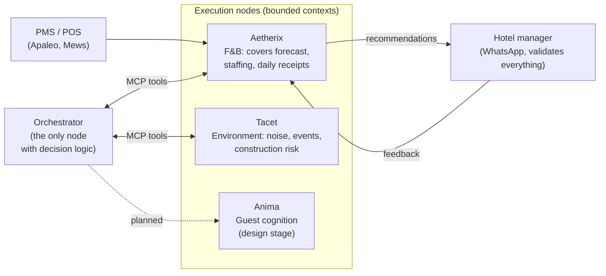

<h1 align="center">Hospitality Agentic Mesh</h1>

  <em>Specialized AI agents for hotel operations, communicating via MCP. Each agent owns one domain. None of them replaces the humans who run the property.</em>

  <a href="https://ivandemurard.com/aetherix">Case study</a> ·
  <a href="https://github.com/IvandeMurard/tacet-app">Tacet (public repo)</a> ·
  <a href="https://www.linkedin.com/in/ivandemurard/">Contact</a>

---

## What this is

This is the public meta-repo of a multi-repo system I've been building solo since late 2025: a network of specialized AI agents ("nodes") for hotel operations. Each node owns a strict bounded context, exposes its capabilities as [MCP](https://modelcontextprotocol.io) tools, and recommends rather than acts. A human manager validates every decision.

The main execution node (Aetherix) lives in a private repo. It targets a real-property pilot and carries security posture, eval baselines and PMS integration details that don't belong in public. This repo documents the architecture and the engineering practices, and links to everything that is public. Deeper access (code walkthrough, live demo) is available on request.

## The Mesh

Design principles, the parts I'd defend in any architecture review:

- **Execution nodes never orchestrate.** Aetherix doesn't know when to run; an orchestrator decides. Perception signals and decision logic are separated by contract.
- **Push-first, UI-less.** The manager gets a daily WhatsApp "receipt" with the forecast, the staffing recommendation and the reasoning. One tap to accept or reject, and that reply becomes training signal.
- **Human-in-the-loop is structural, not a toggle.** No auto-actions. Every guardrail trip is logged with a typed reason.
- **Glue, not replacement.** A PMS-agnostic canonical schema behind adapters; intelligence delivered inside the tools hotels already use.

## What's built vs. what's vision

This is a solo project. The mesh narrative is a north star, not a shipped platform, and this table keeps the two apart.

| Component | Status | Evidence |
|---|---|---|
| **Aetherix**, F&B execution node | **Built** (private): ~16.5k LOC app / ~18.6k LOC tests, staging live on Fly.io, 11 ADRs | Case study; walkthrough on request |
| Forecast pipeline (Prophet + weather/events/occupancy regressors) | Built. Real-data benchmark in progress (Kaggle Recruit dataset vs. naive same-weekday baseline) | Benchmark notebook will land here |
| Daily Receipts over WhatsApp (Twilio) + inbound feedback parsing | Built, on staging | Demo video planned |
| MCP server (atomic tools) | Built (v0) | |
| Eval-by-design: **blocking CI gate** on forecast eval, deterministic Prophet-in-CI | Built. 3 identical CI runs, 0.00pp variance, before flipping the gate to blocking | Write-up planned |
| Runtime guardrails: dead-man's switch, error-rate alerting, feedback-to-training bounds, tiered-confidence circuit breaker, output sanity | Built | |
| **Tacet**, environmental risk node | **Prototype** (~1.4k LOC, public): polar acoustic heatmap, shielding from building footprints | [tacet-app](https://github.com/IvandeMurard/tacet-app) |
| **Orchestrator** | Proto-stub only | |
| **Anima**, guest cognition node | Design documents only | |
| Federated multi-property memory ("Hive") | Designed, not shipped | |

## Engineering practices I'd bring to a team

- **Evals as merge gates, not dashboards.** Golden dataset plus an offline gate in CI (exit codes block the merge), separated by contract from runtime guardrails.
- **Typed failure reasons.** Every guardrail trip carries a machine-readable reason; "it degraded gracefully" is verifiable, not folklore.
- **ADR discipline.** 31 indexed architectural decisions over 8 months, each with context and rollback notes.
- **Continuous discovery as a routine, not an event.** A scheduled weekly scan (automated Monday cron) covers the market, the competitive watchlist (PMS vendors, agentic hospitality startups, MCP ecosystem moves) and new techniques that could speed up production. Findings feed a watchlist that is re-evaluated at each phase gate.
- **Adversarial reviews with multiple frontier models.** Architecture and roadmap get periodically stress-tested by different models playing critic; the July 2026 audit that produced the current 90-day plan came out of one of these sessions.
- **Incident response, practiced.** A real leaked-secrets incident (production `.env` committed) handled end to end: history rewrite, 11/11 credential rotation, GitHub Support purge, post-mortem.
- **Tests outweigh code.** 1.13:1 test-to-app LOC ratio on the main node.

## Current focus (90-day plan, started July 2026)

1. **Proof:** real-data forecast benchmark · closed-loop demo on the Apaleo sandbox (forecast, recommendation, feedback, recalibration) · observability (Logfire traces, LLM cost per recommendation) · F&B manager interviews.
2. **Visibility:** this repo · a technical write-up on the blocking eval gate · a demo video.

## Stack

FastAPI · Python (async, Pydantic v2) · Supabase Postgres + pgvector (HNSW) · Prophet · Claude (multi-LLM provider abstraction) · Mistral embeddings · Redis (Upstash) · Twilio WhatsApp · Apaleo PMS (OAuth2) · Fly.io · GitHub Actions (CI + eval gate + schema-drift gate)

## License

MIT, see [LICENSE](LICENSE). The private node repos carry their own terms.
